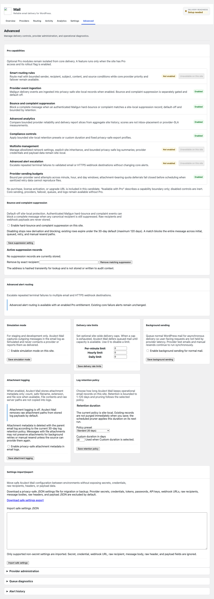
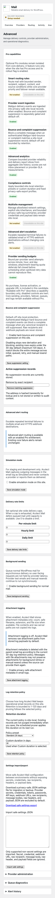

# 0.4.0 Pro candidate claim ledger

Audit snapshot: 2026-08-10. This ledger is for the unreleased
`release/0.4.0` candidate and is not a public release note.

## Evidence range and release state

- Candidate branch: `release/0.4.0`, live origin tip `ad28abb1a2dbaf94e6d3fb26589560ce561c6d1d` at the PR #172 review snapshot.
- Candidate source range: previous stabilization tip `release/0.3.0` through
  the merged candidate commits listed below.
- `CHANGELOG.md` labels `0.4.0` **Unreleased**.
- `onesmtp.php`, `ONESMTP_VERSION`, `package.json`, and `readme.txt` still
  identify the package/public metadata as `0.3.0`; this PR does not change
  those fields.
- The live GitHub release list at audit time reports `v0.2.0` as latest public
  release. This is a release-state conflict to recheck before publication, not
  evidence that 0.3.0 or 0.4.0 is public.

## Claim ledger

| Claim | Status | Exact release-branch evidence | Merged PR/test/browser evidence |
| --- | --- | --- | --- |
| Pro capability decisions are default-deny and require entitlement plus rollout flag. | Shipped | `src/Product/FeatureGate.php`; `src/Plugin.php`; `docs/developer/pro-capability-gates.md`. | [PR #156](https://github.com/mehul0810/aculect-mail/pull/156), `tests/Unit/Product/FeatureGateTest.php`, `tests/Unit/Admin/ProCapabilitiesPanelTest.php`; PR #156 reported 321 PHPUnit tests, PHPStan, PHPCS, JS lint, 7/7 Playwright, and desktop/390px screenshots. |
| Conditional routing rules and request-scoped simulation are available behind `smart_routing`. | Shipped | `src/Admin/RoutingAdmin.php`, `src/Dispatch/RoutingRule*`, `docs/admin/failover-and-rotation.md`. | [PR #159](https://github.com/mehul0810/aculect-mail/pull/159) and [PR #163](https://github.com/mehul0810/aculect-mail/pull/163); routing unit/integration tests and 10/10 Playwright smoke in PR #163; local visual evidence was `routing-simulation-pro-desktop.png` and `routing-simulation-pro-mobile.png`. |
| Provider reliability scoring and bounded advanced reports use aggregate history only. | Shipped | `src/Analytics/ProviderReliabilityScorer.php`, `src/Admin/DashboardAdmin.php`, `src/Repository/MetricsRepository.php`, `docs/admin/advanced-reports.md`. | [PR #157](https://github.com/mehul0810/aculect-mail/pull/157) and [PR #160](https://github.com/mehul0810/aculect-mail/pull/160); unit/integration tests, 9/9 Playwright in PR #160, and desktop/mobile report screenshots. Scores explicitly exclude inbox-placement and provider-SLA guarantees. |
| Compliance retention and fixed privacy-safe export profiles are available behind `compliance_controls`. | Shipped | `src/Core/RetentionPolicy.php`, `src/Logging/LogExportProfile.php`, `src/Admin/SettingsAdmin.php`, `src/Admin/LogAdmin.php`, `docs/admin/email-logs.md`. | [PR #161](https://github.com/mehul0810/aculect-mail/pull/161); 371 PHPUnit tests, PHPStan, lint/build, 10 Playwright tests, and desktop/mobile evidence reported in the merged PR. |
| Advanced alert escalation is available behind `advanced_alerts`; core alerts remain separate. | Shipped | `src/Alerts/FailureAlertDispatcher.php`, `src/Alerts/FailureAlertSettings.php`, `src/Admin/SettingsAdmin.php`, `docs/admin/troubleshooting.md`. | [PR #158](https://github.com/mehul0810/aculect-mail/pull/158); 340 PHPUnit tests, PHPStan, lint/build, 8 Playwright tests, and safe destination/empty/failure/long-value coverage. |
| Multisite network settings and bounded network log summaries are available behind `multisite_management`. | Shipped | `src/Admin/NetworkAdmin.php`, `src/Multisite/NetworkSettingsRepository.php`, `src/Multisite/NetworkLogRepository.php`, `docs/admin/multisite-network.md`, `src/Core/Capabilities.php`. | [PR #165](https://github.com/mehul0810/aculect-mail/pull/165), merge `fcf92b2d508ff56f0b1215f99004d51a3bd118a4`; `tests/Unit/Admin/NetworkAdminTest.php`, `tests/Unit/Multisite/NetworkSettingsRepositoryTest.php`, `tests/Unit/Multisite/NetworkLogRepositoryTest.php`, and 4/4 network-admin Playwright smoke with desktop/390px screenshots. Hosted CI passed across PHP 8.1–8.4, Node build, package verification, and CodeQL. |
| Per-provider quota budgets from [#54](https://github.com/mehul0810/aculect-mail/issues/54) are candidate-shipped behind `provider_quota_budgets`, with deterministic capacity-aware deferral. | Shipped | `src/Quota/ProviderQuotaSettings.php`, `src/Quota/ProviderQuotaManager.php`, `src/Quota/ProviderQuotaLeaseStore.php`, `src/Delivery/DeliveryEngine.php`, `src/Pipeline/SendPipeline.php`, `src/Admin/ProviderAdmin.php`, `docs/admin/provider-setup.md`, `docs/admin/failover-and-rotation.md`. | [PR #166](https://github.com/mehul0810/aculect-mail/pull/166), merged as `07187f346c7821bf2b80c914ddca20f5cddf4124`; 436 tests/3038 assertions, focused quota/attachment/scheduler suite 49 tests/330 assertions, PHPStan 512M, Composer lint, Node lint/build, `git diff --check`, and 17 Playwright tests. Attachment-bearing quota deferrals fail closed before UUID resolution or scheduling with `attachment_quota_deferral_not_persisted`, no retry enqueue, and allowlisted terminal metadata only. |
| Provider adapter catalog is an additive developer contract, not a Pro entitlement. | Shipped | `src/Providers/ProviderAdapterCatalog.php`, `src/Providers/ProviderAdapterContractValidator.php`, `docs/developer/provider-adapters.md`. | [PR #164](https://github.com/mehul0810/aculect-mail/pull/164); 386 PHPUnit tests, PHPCS, PHPStan, and `git diff --check`; no browser/UI change. |
| Mailgun provider-event ingestion and default-off bounce/complaint suppression are candidate-only Pro workflows. | Candidate-shipped (unreleased) | Issue [#63](https://github.com/mehul0810/aculect-mail/issues/63) adds the signed Mailgun route, normalized site-local table, atomic replay-token claim table, retention, and encrypted signing-key setting. Issue [#64](https://github.com/mehul0810/aculect-mail/issues/64) adds the separate `bounce_suppression` gate, suppression table, normalized-event derivation, whole-message dispatch block, admin controls, and retention. | Synthetic fixtures cover normalized event categories, suppression derivation/privacy, gate/default-off behavior, exact multi-recipient matches, expiry, and safe terminal metadata. Browser evidence uses synthetic domains only; no live provider secret or payload is used. |
| Repository-local licensing and update integration contracts are available without a connected service. | Candidate foundation (no network) | `src/Product/Licensing/*`, `src/Admin/ProDistributionPanel.php`, and `docs/developer/licensing-foundation.md`. | Unit tests cover bounded statuses, masking, active-only entitlement, rollout coexistence, empty/error admin states, and absence of raw identifiers. No production activation, update delivery, purchase flow, vendor, or hosted service is claimed. |
| Any claim that tracking, OAuth lifecycle, token refresh/revocation UX, or production license activation/update delivery is available. | Planned/excluded | Open issues [#40](https://github.com/mehul0810/aculect-mail/issues/40), [#50](https://github.com/mehul0810/aculect-mail/issues/50), and [#51](https://github.com/mehul0810/aculect-mail/issues/51); concrete commercial licensing/update delivery is separately deferred beyond [#66](https://github.com/mehul0810/aculect-mail/issues/66). | No shipped source, accepted docs, or merged PR proves these production-service claims. |

## Copy and publication rules

- Use present tense only for the shipped rows above and qualify them as
  candidate/release-branch scope.
- Keep “Available with Pro” descriptive and competitor-neutral. It is not a
  purchase, pricing, tier, site-count, support/SLA, hosted-service, telemetry,
  privacy, availability-date, or license-activation claim.
- Keep core setup, providers, sending, failover, queues, logs, troubleshooting,
  and safe fallback behavior complete for free installations.
- `readme.txt` remains the public 0.3.0 listing and is intentionally unchanged;
  publication requires a separate release-metadata decision.

## Screenshot inventory

Merged candidate PRs reported fixture-backed desktop and narrow admin evidence
for the affected Pro surfaces: PR #156 (capability panel), PR #159/#163
(routing), PR #157/#160 (analytics/reports), PR #161 (retention/export), and
PR #165 (multisite). PR #165 committed deterministic network-admin screenshots
under `docs/admin/screenshots/issue-41/` for deny, settings, empty logs, and
filtered page-2 states at desktop and 390px widths.
This documentation PR captures fresh suppression-capability and Mailgun setup
pairs in its validation run and commits the evidence under
`docs/admin/screenshots/issue-64/` and `docs/admin/screenshots/issue-63/`.
The synthetic fixture contains no provider
credentials, message content, recipients, payloads, or other secrets.

*Figure 1. Desktop candidate settings: suppression is visibly default-off, site-local,
and bounded by retention; the empty state contains no recipient data.*

*Figure 2. Narrow candidate settings at 390px: suppression copy wraps within the
viewport without exposing provider credentials, recipients, or payloads.*

The long-state DataViews fixture also covers 24 synthetic domains at desktop
and 390px widths (`bounce-suppression-long-desktop.png` and
`bounce-suppression-long-mobile.png`); it contains no live recipient or secret.
